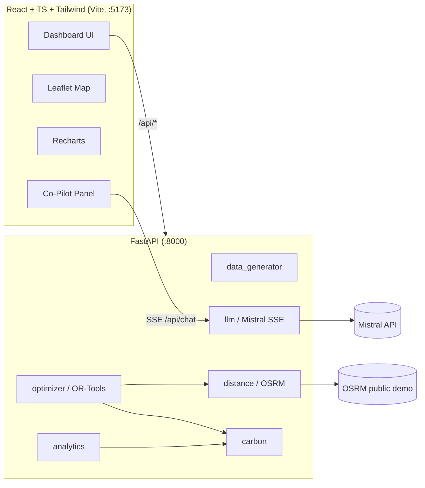

# CEVA Dynamic Routing & Logistics Intelligence POC

A web-based dynamic routing & logistics-intelligence platform for last-mile delivery, branded for CEVA Logistics. The POC demonstrates four differentiated capabilities on a synthetic Delhi NCR dataset:

1. **Dynamic Route Optimization** — Google OR-Tools VRP with capacity, time-windows, max-stops, soft-drop penalties and a **carbon-aware multi-objective cost** (`distance × per-km cost + CO₂e × ₹2,000/tonne`).
2. **Fleet & Asset Utilization Analytics** — load %, time %, stop %, idle vehicles, drop rate, cost per delivery / km / kg.
3. **Carbon Footprint Tracking & Sustainability Scoring** — total CO₂e, per-delivery, per-km, per-kg; baseline vs optimized savings; equivalencies (trees, car-km); EV vs diesel split; Green Score per route (0–100).
4. **AI Logistics Co-Pilot** — Mistral AI (`mistral-large-latest`) with **streaming** responses and the current routes/utilization/carbon/financial state injected as context. Falls back to a deterministic data-grounded answer if no API key is set, so the demo always works.

All wrapped in a **CEVA-branded analytics dashboard** (red `#98012E`, navy `#0B2C5C`, Inter font, clean industrial styling).

---

## Architecture



---

## Quick start (3 commands)

### Option A — Docker

```bash
cp .env.example .env       # add MISTRAL_API_KEY (optional)
docker-compose up --build
# open http://localhost:5173
```

### Option B — local

```bash
cp .env.example .env
./run.sh
# open http://localhost:5173
```

The first run generates `data/depot.json`, `data/vehicles.json`, `data/synthetic_orders.json`. Re-create with `python backend/data_generator.py --regenerate`.

> **No Mistral key?** The Co-Pilot still works — `llm.py` falls back to a deterministic, data-grounded responder that cites real numbers from the current scenario.

---

## 5-minute demo script

1. **Load** — open http://localhost:5173. Initial `/api/data → /api/baseline → /api/optimize` runs automatically. KPIs populate in seconds.
2. **Run Optimization** — click the red CTA. The "Optimized" scenario should show lower distance, cost and CO₂ vs Baseline (the deltas turn green-↓ on the KPI strip).
3. **Carbon tab** — review "X kg CO₂ saved today", trees & car-km equivalencies, EV vs diesel donut, Green Score gauge.
4. **Disruption** — pick "Vehicle Breakdown" → Inject. The fleet drops a truck and re-optimizes; orders get reshuffled, KPIs update.
5. **Co-Pilot** — click the floating "AI" button. Try the chips:
   - "Summarize today's optimization wins"
   - "Which vehicles are underutilized?"
   - "How much CO₂ did we save and what's the equivalent?"
   The response streams in and lists the cited KPIs at the bottom.
6. **Route detail** — click any vehicle on the map or in the Utilization tab to open the slide-in drawer showing stops, ETAs, cumulative-load curve, CO₂, cost and Green Score.

---

## API surface

| Method | Path                | Purpose                                           |
| ------ | ------------------- | ------------------------------------------------- |
| GET    | `/api/data`         | depot + vehicles + orders                         |
| POST   | `/api/baseline`     | naive routes + analytics (round-robin + NN)       |
| POST   | `/api/optimize`     | OR-Tools optimized routes + analytics             |
| POST   | `/api/disrupt`      | inject `new_order` / `vehicle_breakdown` / `traffic_block` then re-optimize |
| GET    | `/api/analytics`    | consolidated KPI + utilization + carbon + financial + service |
| GET    | `/api/carbon`       | carbon-only deep-dive payload                     |
| GET    | `/api/utilization`  | per-vehicle utilization breakdown                 |
| POST   | `/api/chat`         | Mistral streaming SSE with state context injected |
| POST   | `/api/reset`        | restore the original orders + vehicles            |

---

## Carbon model

Defined in `backend/carbon.py`:

| Vehicle      | g CO₂e/km       |
| ------------ | --------------- |
| small_van    | 250 (diesel LCV) |
| medium_truck | 320 (diesel MCV) |
| ev           | 75 (India grid 2025) |

Equivalencies use 21 kg CO₂/yr per mature tree and 170 g/km for an average passenger car. The optimizer prices carbon at **₹2,000/tonne** so route choices reflect both rupee and emission costs.

---

## Project structure

```
ceva-routing-poc/
├── backend/
│   ├── main.py              FastAPI app + endpoints
│   ├── optimizer.py         OR-Tools VRP + naive baseline
│   ├── analytics.py         KPI / utilization / carbon / financial / service
│   ├── carbon.py            emission factors & equivalencies
│   ├── data_generator.py    synthetic Delhi NCR dataset
│   ├── llm.py               Mistral streaming + deterministic fallback
│   ├── distance.py          OSRM table + Haversine fallback
│   ├── models.py            Pydantic models
│   └── requirements.txt
├── frontend/
│   ├── src/
│   │   ├── App.tsx
│   │   ├── theme.ts            CEVA brand tokens
│   │   ├── api.ts              fetch helpers + SSE
│   │   ├── types.ts
│   │   └── components/
│   │       ├── TopBar.tsx
│   │       ├── KpiStrip.tsx
│   │       ├── MapView.tsx
│   │       ├── DisruptionPanel.tsx
│   │       ├── UtilizationTab.tsx
│   │       ├── CarbonTab.tsx
│   │       ├── FinancialTab.tsx
│   │       ├── ServiceTab.tsx
│   │       ├── CoPilotChat.tsx
│   │       └── RouteDrawer.tsx
│   ├── tailwind.config.js
│   └── package.json
├── data/                     auto-generated JSON dataset
├── .env.example
├── docker-compose.yml
├── run.sh
└── README.md
```

---

## Screenshots

> _Screenshot placeholders — capture after first run for the deck._
>
> - `docs/01-dashboard.png` — full dashboard with KPI strip and optimized map
> - `docs/02-carbon-tab.png` — Carbon tab with Green Score gauge & equivalencies
> - `docs/03-copilot.png` — streaming Co-Pilot answer with cited KPIs
> - `docs/04-disruption.png` — before/after a vehicle-breakdown disruption

---

## Phase 2 roadmap

- **Real TMS integration** — pull live orders/SKUs from CEVA's TMS instead of synthetic data; push optimized stops back as dispatch plans.
- **Telematics ingest** — replace static cost/CO₂ factors with measured per-vehicle telematics (fuel burn, kWh, idling, harsh braking).
- **Multi-depot** — graph-based depot selection + inter-depot transfers; per-depot dashboards aggregated to a regional view.
- **Driver mobile app** — ETA confirmations, proof of delivery, real-time re-routing pushed from the optimizer.
- **Predictive disruption** — combine traffic API + weather + historical SLAs to pre-empt re-optimization before delays hit.
- **What-if simulator** — extend the Co-Pilot to run in-process scenarios ("convert V-201 to EV", "add a 9th vehicle") via tool-use.

---

## Limitations & assumptions

- OR-Tools time limit is **8 s**; production deployments should tune this and warm-start from previous solutions.
- OSRM public demo is rate-limited; for production use a self-hosted OSRM or commercial routing API. The Haversine fallback is automatic but less accurate.
- Carbon emission factors are well-to-wheel approximations (India grid 2025) — should be calibrated against CEVA's measured fleet data.
- ROI extrapolation assumes uniform performance across 10 NCR-class depots and 312 working days — meant as an order-of-magnitude figure for executives, not a forecast.
- The deterministic fallback in `llm.py` is intentionally simple; with `MISTRAL_API_KEY` set, full reasoning quality is delegated to `mistral-large-latest`.
- All data is synthetic and seeded with `42`; no real customer / driver / address data is used.

---

CEVA Logistics POC | Confidential | © 2026
